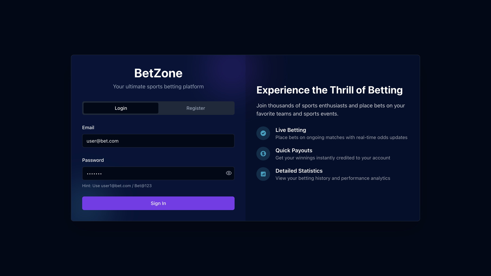
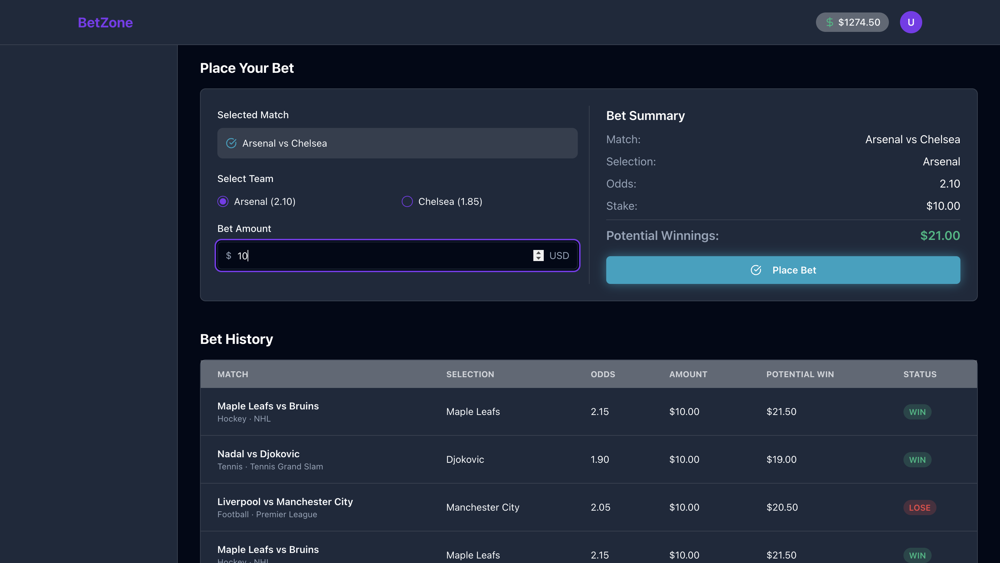

# BetZone - Sports Betting Platform

A mini betting dashboard with React frontend and Node.js backend. This platform allows users to log in, view upcoming matches, place bets, and view bet history.

## Features

- User authentication (login/registration)
- Interactive match listing with filtering options
- Bet placement on matches with real-time odds calculation
- Automatic bet resolution after 30 seconds (random win or lose)
- Detailed bet history tracking

## Technology Stack

- **Frontend**: React, TailwindCSS
- **State Management**: React Query (TanStack Query)
- **Form Handling**: React Hook Form with Zod validation
- **Backend**: Node.js with Express
- **Data Storage**: JSON file-based storage (MongoDB ready schemas)

## Screenshots

### 🔐 Login Page




### 📁 Bet History Page



## Setup Instructions

### Prerequisites

- Node.js (version 18)
- npm or yarn

### Installation

1. Clone the repository

   ```
   git clone https://github.com/aman-638/BetZone.git
   cd BetZone
   ```

2. Install dependencies

   ```
   npm install
   ```

3. Start the development server

   ```
   npm run dev
   ```

4. Open your browser and navigate to `http://localhost:5000`

5. Default credentials:
   - Email: user@bet.com
   - Password: Bet@123
